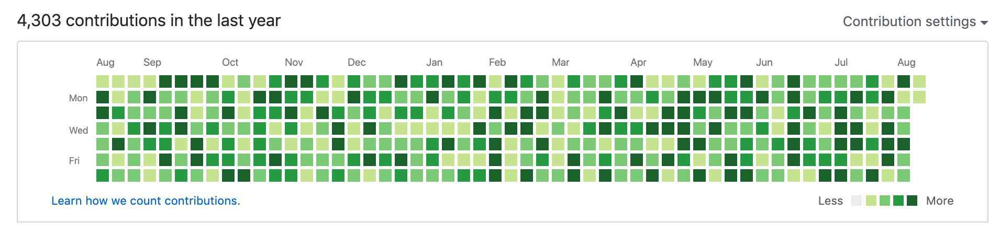
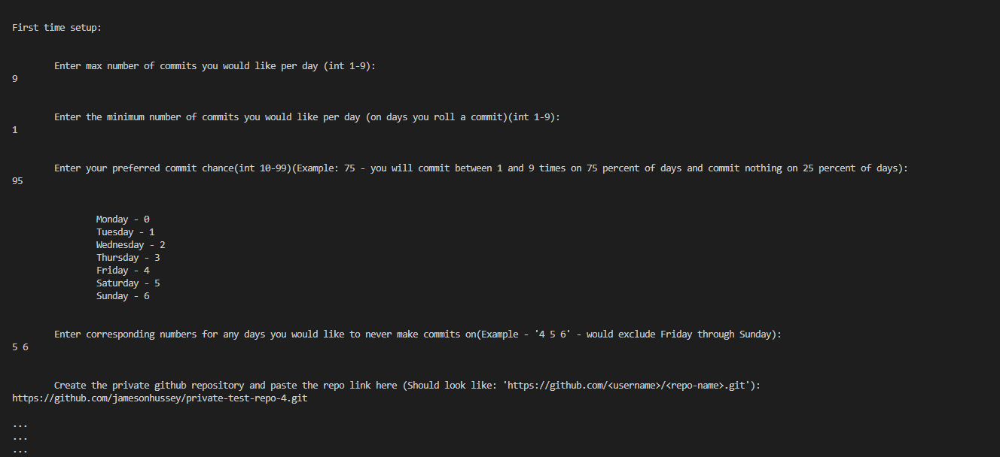
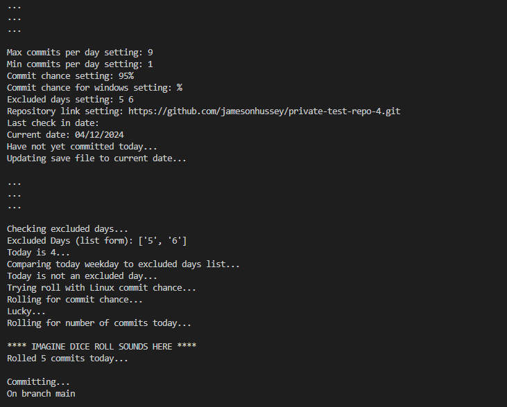
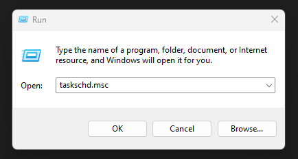

# Git-Real-Green Overview
The goal of Git-Real-Green is to fill up all your GitHub profile's little green squares with different shades of green in order to appeal to recruiters. 

The goal:
  

# *** *IMPORTANT NOTES* ***
- Must have Python installed
- Must be logged into GitHub in terminal
- Be sure to run program in its own folder so it doesn't create random files all over your desktop or something.
- If you delete the repo that the program is using, this will retroactively delete your calendar commits/green squares. This is good to know in case you want to intentionally clear your calendar of fake commits, but also so you don't accidentally delete a year's worth of running this program.
- Program should work for Mac, Linux, and Windows.
  
- Make GitHub repo PRIVATE if you would like to hide the fact that you're just committing one letter "x" to a JavaScript file several times per day. 
- After making the repo private, be sure to change your GitHub profile calendar setting to display commits to private repos. This will allow your number of private commits to display without allowing others to see what the repo or commits are. Screenshot of setting below: 
  

  
- I want to achieve this with as little required effort as possible, so at the bottom of this readme, I've included a way to set this program to run automatically in the background whenever your computer is on. If you're worried about a performance impact, check the following screenshot:  

# How It Works
It will essentially "roll" several random numbers to decide if a commit will happen on any particular day, how many commits in a user-specified range will be auto-committed, etc. in order to give a more realistic appearance than simply committing one set amount of things per day every single day. It has a self-contained folder to track settings, when the last commits were done (so it doesn't commit more often than it should), and hold the Git Repo containing a "main.js" file that is edited every time a commit is made.

 This program comes with several options to customize your automatic commits. These settings include:

- Max number of commits allowed per day
- Min number of commits required per day
- Chance of committing on any given day (If you choose 95% for example, the program will run 95% of the time, and then do nothing on 5% of days to simulate a random day off/sick day)
- Excluded days (For taking weekends off or any other days)

# Screenshots
*Settings configured on first run of the program:*
  
    

*Normal program run after first time setup is completed:*
  

# Technologies Used

- Python
- Subprocess, OS, datetime, time, and random libraries
- Windows .bat file
- Windows Task Scheduler
- GitHub

# Getting Started

You can run this program in a number of ways:
- Simply run in VS Code
- Run in terminal manually
- Run on windows by double clicking batch (.bat) file after editing the path it uses in notepad (directions for how to do so are within the provided run_git-real-green.bat file)
- Add said batch file to a windows Task Scheduler task in order to have it run automatically on startup of your computer so it requires literally zero effort whatsoever after setup.

# Setting Up Windows Task Scheduler for Zero Effort Mode (Windows)
0. Make sure you've opened the .bat file in notepad and changed the indicated file path
1. Press Windows Button + R
2. Type "taskschd.msc" until it appears in the dropdown, and select it
3. Click OK
    

4. Right click "Task Scheduler Library" on the left and select "New Folder..."
5. Name the folder "git-real-green"
6. Select this folder from the dropdown.
7. Select "Create Basic Task..." on the right side under "Actions"
8. Name it "run_git-real-green" and click next.
9. Select "When I log on" option for "When do you want the task to start?" and click next.
10. Select "Start a program" for the action to perform and click next.
11. Browse to or copy and paste path to your BATCH FILE for the "Program/Script:" field (C:\Your\Path\Here\run_git-real-green.bat). Don't click next yet.
12. Fill the "Start in (optional):" field with the folder containing your batch and main.py files (C:\Your\Path\Here). Ok, now click next.
13. Check the box at the bottom for "Open properties dialogue for this task when I click Finish" and click finish.
14. If properties opened, great. Select the new task and click properties on the bottom right side of the screen above Delete.
15. Navigate to "General" tab within properties. Check "Run with highest privileges" box (this is needed to create and edit files automatically). Also, select "Windows 10" from the "Configure for:" dropdown menu.
  
15.5. If you would like to have this program run completely in the background without popping up with a window at all, you can check "Hidden" box at the bottom next to "Configure for:", however I would probably wait a couple runs to make sure it's working correctly at first. 
  

16. Navigate to "Conditions" tab and uncheck "Start only if on AC power"
17. Navigate to "Settings" tab and uncheck the "Stop task if it runs longer than:" box (I tend to leave my computer on constantly so this is personal preference)
18. Make sure "Do not start a new instance" is selected at the bottom drop down.
19. Click OK at the bottom.
20. That should be all there is to it. You can test the task via the "Run" option on the right side. You may need to re-login to GitHub on terminal on first launch, but just delete the folder containing "settings.txt" that the program created, and run it again, and it should work fine after that.

This video may also help if you run into issues after trying these steps. 
 
https://www.youtube.com/watch?v=IsuAltPOiEw
 
It's for running a python file, not a batch file, but the inclusion of more visuals may help.
